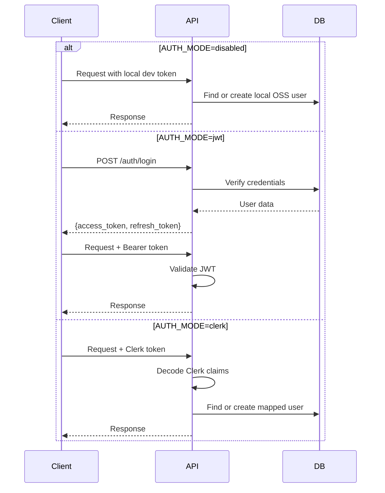
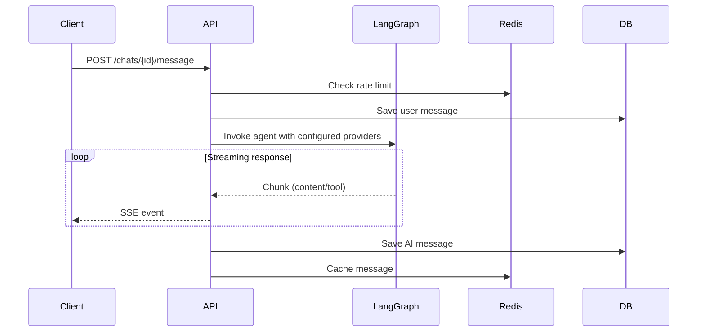
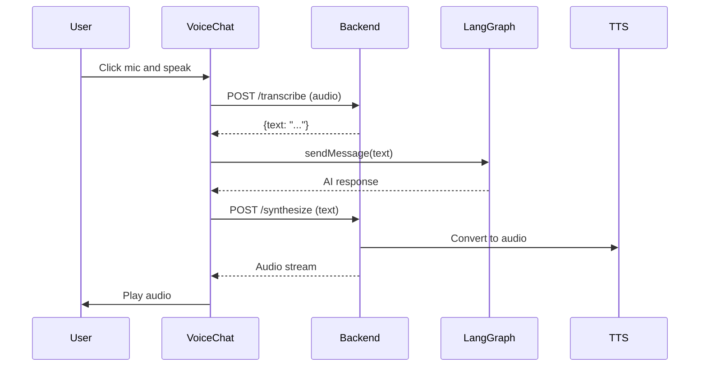
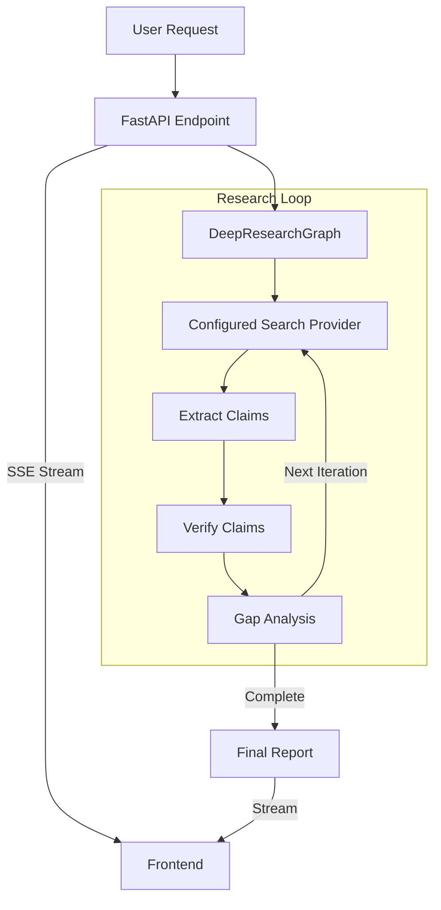

# Perception Architecture

Perception is an open-source deep research and agentic search workspace.

This document explains the current OSS MVP architecture: the local-first reference stack, the runtime boundaries for auth/model/search providers, and the main product flows that new contributors should preserve.

## 🏗️ High-level architecture

```mermaid
graph TD
    Client[Client (React/Vite)]
    LB[Load Balancer]
    API[FastAPI Backend]
    DB[(PostgreSQL)]
    Redis[(Redis Cache)]
    LLM[LangGraph + Configured Model Provider]
    STT[OpenAI Whisper]
    TTS[OpenAI TTS / ElevenLabs]

    Client -->|HTTPS/WSS| LB
    LB --> API
    API -->|Read/Write| DB
    API -->|Cache/Rate Limit| Redis
    API -->|Inference| LLM
    API -->|Transcribe| STT
    API -->|Synthesize| TTS
```

## Reference OSS stack

The default documented setup is:

- `AUTH_MODE=disabled`
- `MODEL_PROVIDER=openai_compatible`
- `EMBEDDING_PROVIDER=openai_compatible`
- `SEARCH_PROVIDER=duckduckgo`

That path should work without Clerk and without code edits.

Optional integrations stay available behind configuration:

- `AUTH_MODE=jwt`
- `AUTH_MODE=clerk`
- `MODEL_PROVIDER=groq|google`
- `SEARCH_PROVIDER=tavily|both`

## 🖥️ Frontend architecture

### Project structure

```text
client/src/
├── lib/
│   ├── chat-api.ts          # API client for chat streaming
│   ├── auth-api.ts          # API client for authentication
│   └── auth-config.ts       # Frontend auth mode selection
├── hooks/
│   ├── use-chat.ts          # Chat logic hook
│   └── use-auth.tsx         # Authentication hook
├── store/
│   ├── chatStore.ts         # Chat and Deep Research state
│   └── treeStore.ts         # Conversation tree state
└── components/
    ├── chat/                # Chat UI and Deep Research entry points
    ├── landing/             # OSS marketing surface
    └── tree/                # Branching conversation UI
```

### Key layers

1. **API layer**: direct communication with the backend, including SSE streaming.
2. **State layer**: Zustand stores for chat, Deep Research, and tree state.
3. **Hooks**: `useChat` and `useAuth` expose runtime behavior to components.
4. **UI layer**: chat workspace, landing page, auth surfaces, and tree visualization.

### Frontend auth modes

- **disabled**: local OSS demo mode, injects a stable local user and token
- **jwt**: self-hosted protected mode using backend-issued tokens
- **clerk**: optional hosted auth integration

The client should degrade cleanly when Clerk is not active.

### Chat data flow

```text
User Input (ChatInput)
    ↓
Custom Hook (use-chat)
    ↓
Store Action (sendMessage)
    ↓
API Layer (streamChat)
    ↓
Backend API (SSE Stream)
    ↓
Callbacks (onContent, onCheckpoint)
    ↓
UI Updates (ChatMessages)
```

## ⚙️ Backend architecture

### Tech stack

- **Framework**: FastAPI (async)
- **Database**: PostgreSQL + SQLModel
- **Caching**: Redis / Upstash
- **AI engine**: LangGraph + config-driven model/search providers
- **Auth**: disabled, JWT, or Clerk

### Runtime provider boundaries

Perception keeps the OSS MVP abstractions narrow on purpose:

- **Auth provider**: selected by `AUTH_MODE`
- **Chat model provider**: selected by `MODEL_PROVIDER`
- **Embedding provider**: selected by `EMBEDDING_PROVIDER`
- **Search provider**: selected by `SEARCH_PROVIDER`

Those selections are normalized in `server/app/core/config.py` and instantiated in `server/app/services/provider_factory.py`.

### System components

#### 1. Authentication flow



#### 2. Chat message flow



#### 3. Voice mode architecture



## 🌳 Conversation tree architecture

The branching conversation system enables non-linear research sessions using a tree data structure.

### Data model

- **ConversationNode**: a single message exchange
  - `parent_id`: previous node
  - `branch_name`: branch label
  - `depth`: distance from root
- **ConversationTree**: metadata for the whole chat
  - `active_node_id`: current user position
- **NodeRelationship**: denormalized traversal helper

### Logic flow

1. **Message sending**
   - user sends a message from the `active_node`
   - the system creates a child node
   - lineage is rebuilt from that node to root
   - LangGraph receives the linearized history and responds
2. **Branching**
   - users can fork a branch from any node
   - regenerate creates a sibling AI node
3. **Visualization**
   - the frontend fetches the full tree
   - React Flow renders the graph
   - clicking a node changes `active_node_id`

## 🔎 Deep Research architecture

Deep Research is the headline OSS workflow. It performs iterative, evidence-backed research using a specialized LangGraph agent plus the configured search provider.

### Core components

1. **DeepResearchGraph** orchestrates the loop.
   - nodes: `retriever`, `extract_claims`, `verify_claims`, `gap_analysis`, `synthesis`
   - flow: Retrieve → Extract → Verify → Gap Analysis → Synthesis
2. **Research chains** handle extraction, verification, gap analysis, and final report generation.

### Data flow



### Output structure

The final report is a structured JSON object containing:

- Executive Summary
- Background
- Key Findings
- Technical Details
- Opportunities and Risks
- Applications
- References
- Research Log

### Extension points that matter for contributors

- `server/app/core/config.py`: env-driven runtime contract
- `server/app/services/provider_factory.py`: chat, embedding, and search provider wiring
- `server/app/core/dependencies.py`: auth mode behavior
- `server/app/routes/deep_research_routes.py`: Deep Research streaming path
- `client/src/lib/auth-config.ts`: frontend auth mode selection
- `client/src/components/chat/DeepResearchModal.tsx`: first-run Deep Research entry point

## 🗄️ Deployment architecture

```text
                    Internet
                       │
                       ▼
              ┌────────────────┐
              │  Load Balancer │
              └────────┬───────┘
                       │
         ┌─────────────┼─────────────┐
    ┌────▼───┐   ┌────▼───┐   ┌────▼───┐
    │FastAPI │   │FastAPI │   │FastAPI │
    │Worker 1│   │Worker 2│   │Worker N│
    └────┬───┘   └────┬───┘   └────┬───┘
         │            │            │
         └────────────┼────────────┘
                      │
         ┌────────────┼────────────┐
    ┌────▼─────┐ ┌───▼────┐ ┌────▼──────┐
    │PostgreSQL│ │ Redis  │ │ LangGraph │
    └──────────┘ └────────┘ └───────────┘
```
