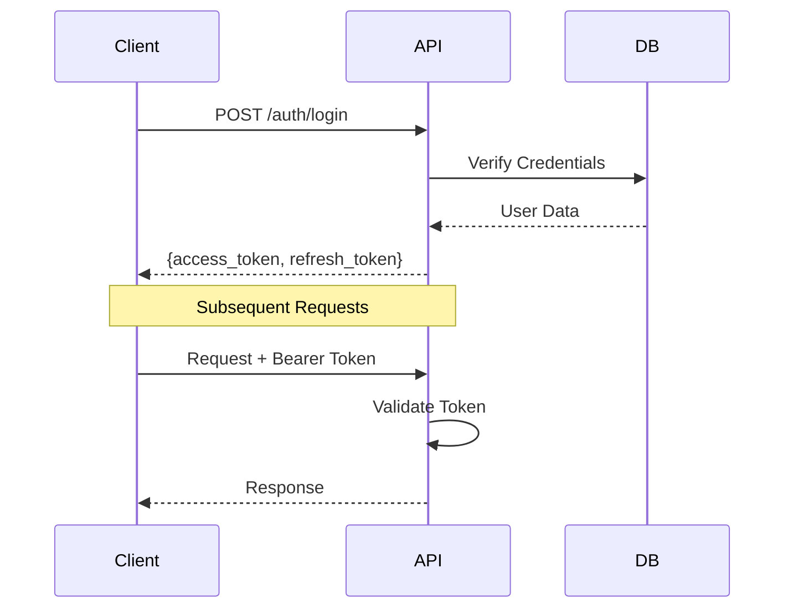
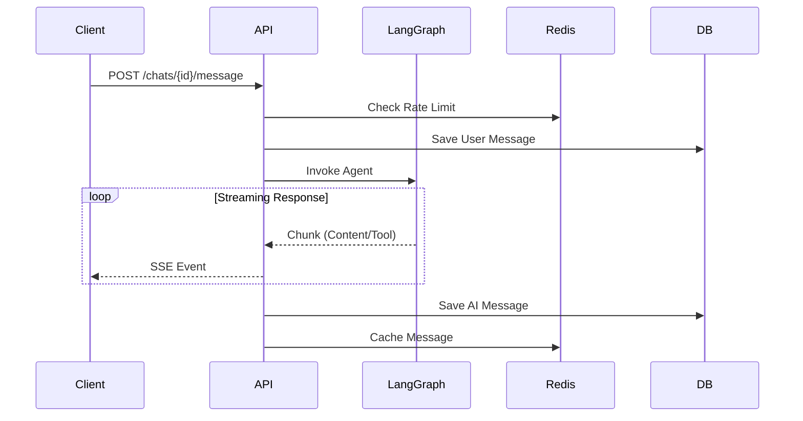

# Perception AI - System Architecture

This document provides a comprehensive overview of the Perception AI system architecture, covering the backend, frontend, and specific feature implementations like Voice Mode and Chat.

## 🏗️ High-Level Architecture

```mermaid
graph TD
    Client[Client (React/Next.js)]
    LB[Load Balancer]
    API[FastAPI Backend]
    DB[(PostgreSQL)]
    Redis[(Redis Cache)]
    LLM[LangGraph + Groq]
    STT[OpenAI Whisper]
    TTS[OpenAI TTS / ElevenLabs]

    Client -->|HTTPS/WSS| LB
    LB --> API
    API -->|Read/Write| DB
    API -->|Cache/Rate Limit| Redis
    API -->|Inference| LLM
    API -->|Transcribe| STT
    API -->|Synthesize| TTS
```

---

## 🖥️ Frontend Architecture

### Project Structure
```
client/src/
├── lib/
│   ├── chat-api.ts          # API client for chat streaming
│   └── auth-api.ts          # API client for authentication
├── services/
│   └── chat.service.ts      # Business logic layer
├── store/
│   └── chatStore.ts         # Global state (Zustand)
├── hooks/
│   ├── use-chat.ts          # Chat logic hook
│   └── use-auth.tsx         # Authentication hook
└── components/
    └── chat/                # Chat UI components
```

### Key Layers
1.  **API Layer**: Direct communication with backend (Axios/Fetch). Handles SSE for streaming.
2.  **Service Layer**: Manages business logic (e.g., stream lifecycle).
3.  **State Management**: Zustand for global state (user, conversations, messages).
4.  **Hooks**: Custom hooks (`useChat`, `useAuth`) to expose logic to components.
5.  **UI Components**: Presentation layer (Shadcn UI + Tailwind).

### Chat Data Flow
```
User Input (ChatInput) 
    ↓
Custom Hook (use-chat) 
    ↓
Store Action (sendMessage) 
    ↓
API Layer (streamChat) 
    ↓
Backend API (SSE Stream) 
    ↓
Callbacks (onContent, onCheckpoint) 
    ↓
UI Updates (ChatMessages)
```

---

## ⚙️ Backend Architecture

### Tech Stack
- **Framework**: FastAPI (Async)
- **Database**: PostgreSQL (Neon.tech) + SQLModel
- **Caching**: Redis (aioredis)
- **AI Engine**: LangGraph + Groq (Llama 3)
- **Auth**: JWT (Access + Refresh Tokens)

### System Components

#### 1. Authentication Flow


#### 2. Chat Message Flow (Streaming)


#### 3. Voice Mode Architecture


---

## 🗄️ Database Schema

### Users
- `id`: PK
- `username`: Unique
- `email`: Unique
- `password_hash`: Bcrypt hash

### Chats
- `id`: PK
- `user_id`: FK -> Users
- `title`: String
- `checkpoint_id`: LangGraph State ID

### Messages
- `id`: PK
- `chat_id`: FK -> Chats
- `role`: user/assistant
- `content`: Text
- `metadata`: JSON (for tools/search info)

---

## 🚀 Deployment Architecture

```
                    Internet
                       │
                       ▼
              ┌────────────────┐
              │  Load Balancer │
              └────────┬───────┘
                       │
         ┌─────────────┼─────────────┐
    ┌────▼───┐   ┌────▼───┐   ┌────▼───┐
    │FastAPI │   │FastAPI │   │FastAPI │
    │Worker 1│   │Worker 2│   │Worker N│
    └────┬───┘   └────┬───┘   └────┬───┘
         │            │            │
         └────────────┼────────────┘
                      │
         ┌────────────┼────────────┐
    ┌────▼─────┐ ┌───▼────┐ ┌────▼──────┐
    │PostgreSQL│ │ Redis  │ │ LangGraph │
    └──────────┘ └────────┘ └───────────┘
```
