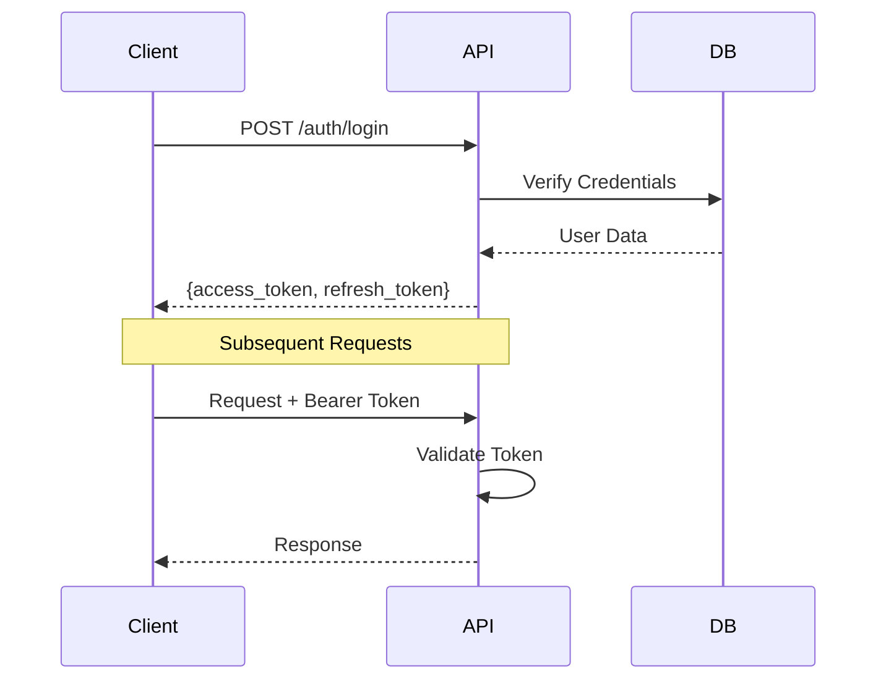
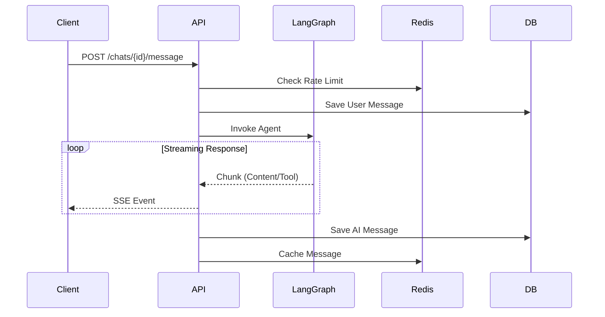
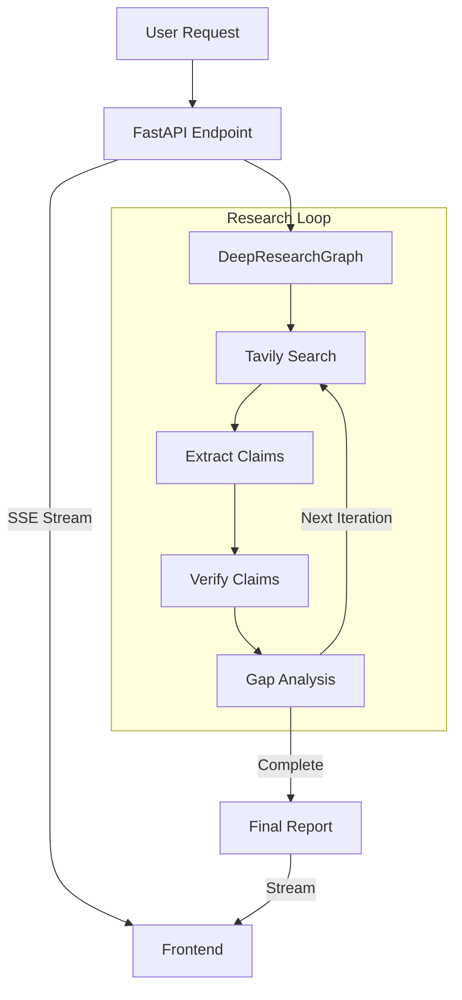

# Perception AI - System Architecture

This document provides a comprehensive overview of the Perception AI system architecture, covering the backend, frontend, and specific feature implementations like Voice Mode and Chat.

## 🏗️ High-Level Architecture

```mermaid
graph TD
    Client[Client (React/Next.js)]
    LB[Load Balancer]
    API[FastAPI Backend]
    DB[(PostgreSQL)]
    Redis[(Redis Cache)]
    LLM[LangGraph + Groq]
    STT[OpenAI Whisper]
    TTS[OpenAI TTS / ElevenLabs]

    Client -->|HTTPS/WSS| LB
    LB --> API
    API -->|Read/Write| DB
    API -->|Cache/Rate Limit| Redis
    API -->|Inference| LLM
    API -->|Transcribe| STT
    API -->|Synthesize| TTS
```

---

## 🖥️ Frontend Architecture

### Project Structure
```
client/src/
├── lib/
│   ├── chat-api.ts          # API client for chat streaming
│   └── auth-api.ts          # API client for authentication
├── services/
│   └── chat.service.ts      # Business logic layer
├── store/
│   └── chatStore.ts         # Global state (Zustand)
├── hooks/
│   ├── use-chat.ts          # Chat logic hook
│   └── use-auth.tsx         # Authentication hook
└── components/
    └── chat/                # Chat UI components
```

### Key Layers
1.  **API Layer**: Direct communication with backend (Axios/Fetch). Handles SSE for streaming.
2.  **Service Layer**: Manages business logic (e.g., stream lifecycle).
3.  **State Management**: Zustand for global state (user, conversations, messages).
4.  **Hooks**: Custom hooks (`useChat`, `useAuth`) to expose logic to components.
5.  **UI Components**: Presentation layer (Shadcn UI + Tailwind).

### Chat Data Flow
```
User Input (ChatInput) 
    ↓
Custom Hook (use-chat) 
    ↓
Store Action (sendMessage) 
    ↓
API Layer (streamChat) 
    ↓
Backend API (SSE Stream) 
    ↓
Callbacks (onContent, onCheckpoint) 
    ↓
UI Updates (ChatMessages)
```

---

## ⚙️ Backend Architecture

### Tech Stack
- **Framework**: FastAPI (Async)
- **Database**: PostgreSQL (Neon.tech) + SQLModel
- **Caching**: Redis (aioredis)
- **AI Engine**: LangGraph + Groq (Llama 3)
- **Auth**: JWT (Access + Refresh Tokens)

### System Components

#### 1. Authentication Flow


#### 2. Chat Message Flow (Streaming)


#### 3. Voice Mode Architecture


---

## 🌳 Conversation Tree Architecture

The **Branch-Your-LLM** system enables non-linear conversations using a tree data structure.

### Data Model
- **ConversationNode**: Represents a single message exchange (User + AI).
  - `parent_id`: Links to previous node.
  - `branch_name`: Identifies the branch (e.g., "Main", "Main.2").
  - `depth`: Distance from root.
- **ConversationTree**: Metadata for the entire chat.
  - `active_node_id`: Tracks the user's current position in the tree.
- **NodeRelationship**: Denormalized table for efficient traversal.

### Logic Flow
1.  **Message Sending**:
    -   User sends message from `active_node`.
    -   System creates new `ConversationNode` as child.
    -   **Lineage Construction**: System walks up the tree from the new node to root to build the conversation history context.
    -   **LangGraph**: Receives the linear history and generates response.
2.  **Branching**:
    -   **Fork**: User creates a sibling node at any point.
    -   **Regenerate**: System creates a sibling AI node.
3.  **Visualization**:
    -   Frontend fetches the full tree structure.
    -   **ReactFlow** renders the graph.
    -   User clicks nodes to change `active_node_id`.

### Database Schema (Tree)
```sql
CREATE TABLE conversation_nodes (
    id VARCHAR(36) PRIMARY KEY,
    parent_id VARCHAR(36) REFERENCES conversation_nodes,
    user_message TEXT,
    ai_message TEXT,
    branch_name VARCHAR(100),
    depth INTEGER
);
```

## � Deep Research Architecture

Deep Research Mode performs iterative, evidence-backed research using a specialized LangGraph agent.

### Core Components

1.  **DeepResearchGraph**: A LangGraph-based agent that orchestrates the research process.
    -   **Nodes**: `retriever`, `extract_claims`, `verify_claims`, `gap_analysis`, `synthesis`.
    -   **Flow**: Iterative loop (Retrieve → Extract → Verify → Gap Analysis) → Final Synthesis.

2.  **Research Chains**: Specialized LangChain chains for specific tasks.
    -   `extraction_chain`: Extracts factual claims from documents.
    -   `verification_chain`: Verifies claims against sources.
    -   `gap_chain`: Identifies knowledge gaps.
    -   `synthesis_chain`: Generates the final structured report.

### Data Flow



### Output Structure
The final report is a structured JSON object containing:
-   Executive Summary
-   Background
-   Key Findings
-   Technical Details
-   Opportunities & Risks
-   Applications
-   References
-   Research Log

## �🗄️ Database Schema

### Users
- `id`: PK
- `username`: Unique
- `email`: Unique
- `password_hash`: Bcrypt hash

### Chats
- `id`: PK
- `user_id`: FK -> Users
- `title`: String
- `checkpoint_id`: LangGraph State ID

### Messages
- `id`: PK
- `chat_id`: FK -> Chats
- `role`: user/assistant
- `content`: Text
- `metadata`: JSON (for tools/search info)

---

## 🚀 Deployment Architecture

```
                    Internet
                       │
                       ▼
              ┌────────────────┐
              │  Load Balancer │
              └────────┬───────┘
                       │
         ┌─────────────┼─────────────┐
    ┌────▼───┐   ┌────▼───┐   ┌────▼───┐
    │FastAPI │   │FastAPI │   │FastAPI │
    │Worker 1│   │Worker 2│   │Worker N│
    └────┬───┘   └────┬───┘   └────┬───┘
         │            │            │
         └────────────┼────────────┘
                      │
         ┌────────────┼────────────┐
    ┌────▼─────┐ ┌───▼────┐ ┌────▼──────┐
    │PostgreSQL│ │ Redis  │ │ LangGraph │
    └──────────┘ └────────┘ └───────────┘
```
