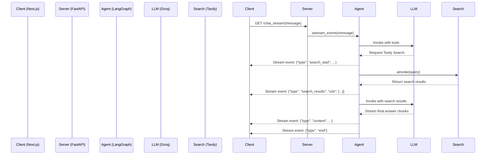

# Perception


Perception is an AI-powered research assistant designed to provide real-time, search-augmented answers. It features a sleek, streaming chat interface built with Next.js and a high-performance Python backend powered by LangGraph, Groq, and Tavily Search.

The application intelligently decides when to search the web for up-to-date information, showing its process transparently to the user—from searching and reading sources to writing the final response.

## Key Features

- **Real-time Streaming:** Responses are streamed token-by-token from the backend to the frontend using Server-Sent Events (SSE).
- **Search-Augmented Generation:** The AI autonomously uses Tavily Search to find relevant, current information to answer queries.
- **Stateful Conversations:** Built with LangGraph's memory checkpointer, the assistant remembers the context of the conversation.
- **Transparent AI Process:** The UI visualizes the AI's current task, such as "Searching for...", "Reading sources...", and "Writing response...".
- **High-Performance Backend:** Leverages the Groq API for extremely fast LLM inference (`meta-llama/llama-4-scout-17b-16e-instruct`) and FastAPI for a robust server.
- **Modern Frontend:** A responsive and intuitive chat interface built with Next.js, React, and Tailwind CSS.

## Architecture

The project consists of a separate frontend and backend.

1.  **Client (Next.js):** The user interacts with a React-based web interface. When a message is sent, it establishes an SSE connection to the backend.
2.  **Server (FastAPI & LangGraph):**
    - The FastAPI server receives the user's query.
    - A LangGraph agent processes the query. It first invokes the Groq LLM.
    - The LLM decides if it needs to search the web using the provided Tavily Search tool.
    - If a search is required, the graph executes the search and feeds the results back to the LLM.
    - The LLM synthesizes the final answer using the search context.
    - Throughout this process, status updates (checkpoints, search progress, content chunks) are streamed back to the client via SSE.



## Tech Stack

- **Frontend:**
  - [Next.js](https://nextjs.org/)
  - [React](https://reactjs.org/)
  - [Tailwind CSS](https://tailwindcss.com/)
  - [Lucide React](https://lucide.dev/) (Icons)
- **Backend:**
  - [Python](https://www.python.org/)
  - [FastAPI](https://fastapi.tiangolo.com/)
  - [LangGraph](https://python.langchain.com/docs/langgraph)
  - [LangChain](https://www.langchain.com/)
- **AI & Services:**
  - [Groq](https://groq.com/) (LLM Inference)
  - [Tavily AI](https://tavily.com/) (Search API)
- **Containerization:**
  - [Docker](https://www.docker.com/)

## Getting Started

### Prerequisites

- Node.js and npm (or equivalent)
- Python 3.12+ and pip
- Docker (optional, for containerized deployment)
- API keys for [Groq](https://console.groq.com/keys) and [Tavily AI](https://app.tavily.com/home).

### 1. Configure Backend

First, set up the backend server.

1.  Navigate to the `server` directory:
    ```bash
    cd server
    ```
2.  Create and activate a virtual environment:
    ```bash
    python -m venv venv
    source venv/bin/activate  # On Windows, use `venv\Scripts\activate`
    ```
3.  Install the required Python packages:
    ```bash
    pip install -r requirements.txt
    ```
4.  Create a `.env` file in the `server` directory and add your API keys:
    ```
    GROQ_API_KEY="gsk_..."
    TAVILY_API_KEY="tvly-..."
    ```
5.  Run the FastAPI server:
    ```bash
    uvicorn app:app --host 0.0.0.0 --port 8000 --reload
    ```
    The server will be running at `http://localhost:8000`.

### 2. Configure Frontend

Next, set up and run the Next.js client.

1.  In a new terminal, navigate to the `client` directory:
    ```bash
    cd client
    ```
2.  Install the Node.js dependencies:
    ```bash
    npm install
    ```
3.  Create a `.env.local` file in the `client` directory to point to your backend:
    ```
    NEXT_PUBLIC_BACKEND_URL=http://localhost:8000
    ```
4.  Run the development server:
    ```bash
    npm run dev
    ```
    The application will be available at `http://localhost:3000`.

### Using Docker (Server)

You can also run the server inside a Docker container.

1.  Ensure your `.env` file is created in the `server` directory as described above.
2.  Build the Docker image from the root directory:
    ```bash
    docker build -t perception-server ./server
    ```
3.  Run the container, passing in the environment variables:
    ```bash
    docker run -p 8000:8000 --env-file ./server/.env perception-server
    ```
    The server will be exposed on `localhost:8000`, and you can run the client locally to connect to it.
